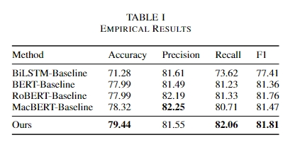

# CS3602 Slot Language Understanding

In this repo, we complete the final project for CS3602 (Natural Language Understanding). Give the dataset `data/train.json` for training and `data/developement.json` for testing. The project is about slot language understanding, where the datasets contain (action, slot, value) triples and we need to extract these information from the given ASR inputs.

## Environment Setup

- Build the basic conda environment
```
conda env create -f environment.yaml
```

- Install the dependencies

```
pip install -r requirements.txt
```

- Install `text2vec`
```
pip install -U text2vec
```


## Usage

For training on the given dataset, run the following command in shell

```shell
python scripts/slu_fused_bert.py --expri=<name of the experiment> --device=<gpu_id, -1 for cpu>
```

For other arguments, refer to `utils/args.py` for modification. The training results will be stored in `./checkpoints`, `./visualization`. If `--get_wrong_examples` is set to true, then you can find the wrong examples in `./wrong_examples`.


For testing on the given dataset, run the following command in shell

```shell
python scripts/slu_fused_bert.py --expri=<name of the experiment> --device=<gpu_id, -1 for cpu> --testing --ckpt <path to checkpoint>
```


## Result

It is worth noting that it is therotically impossible to predict the correct result for 12% of the test data, as the *value* of the label is not in the asr input. Since we can only extract the *value* from the asr input, predicting the correct result would require generative methods, which are not available in our model. Empircal results of the model is shown as follows.

